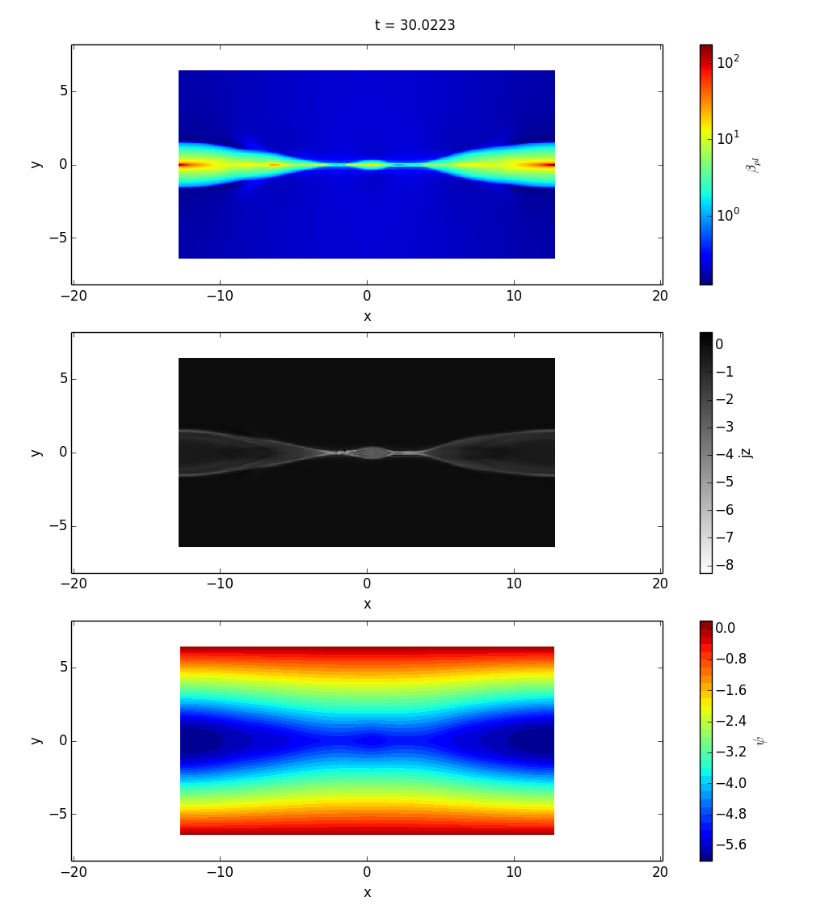

Command Line Utilities
======================

p2d
---

``p2d`` is a command line script for quickly generating plots. Here is an example.

``p2d -t 30 --slice z=0 -p beta -o log -p jz -o lin_0 -p psi -o style_contour,levels_30 dip_0288_0.00500_0.50/*.3df.xdmf``

viscid_diff
-----------

``viscid_diff`` is a command line script for diffing two files. By default it's very terse, but it can be made fairly verbose. The example below diffs two timestps from the same run. A more useful use case for this utility is diffing two different runs that you expect to be equal, but you get the idea.

``viscid_diff --show *.3df.{000200,000201}.xdmf rr``

.. image:: images/viscid_diff_ex.png
    :align: center
