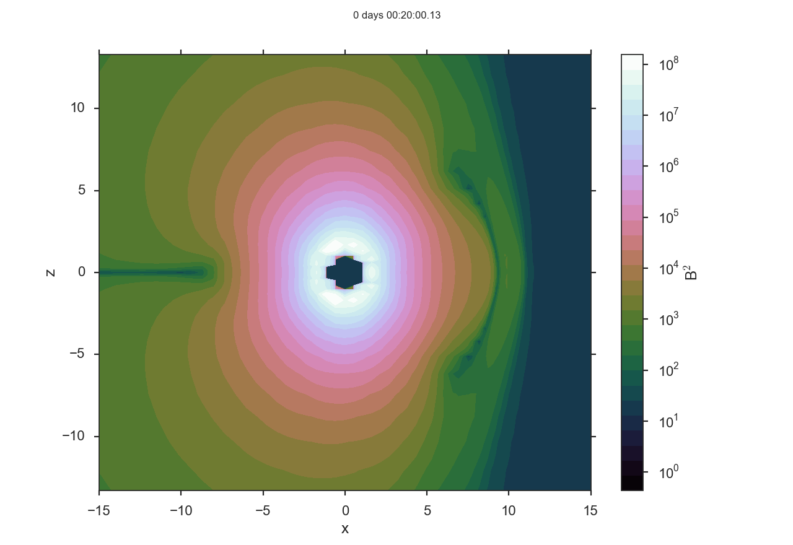

Command Line Utilities
======================

viscid_2d
---------

``viscid_2d`` is a command line script for quickly generating 2D plots. Here is an example.

``viscid_2d -t 30 --slice z=0 -p beta -o log -p jz -o lin_0 -p psi -o style_contour,levels_30 dip_0288_0.00500_0.50/*.3df.xdmf``

.. image:: images/p2d_dip_0288.png
    :align: center

If the evaluator is enabled in your viscidrc file (off by default for security reasons), you can also do math from the command line.

``viscid_2d -t T1:00:00.00 -o x_-15.0_15.0,y_-8.0_8.0 --slice y=0 -p "B$^2$=bx**2+by**2+bz**2" -o log,style_contourf,levels_30 --timeformat dhms $DEV/src/Viscid/sample/*.3df.xdmf``

viscid_ts
---------

``viscid_ts`` is a script for quickly generating time series plots...

``viscid_2d -t T1:00:00.00 -o x_-15.0_15.0,y_-8.0_8.0 --slice y=0 -p "B$^2$=bx**2+by**2+bz**2" -o log,style_contourf,levels_30 --timeformat dhms $DEV/src/Viscid/sample/*.3df.xdmf``

viscid_diff
-----------

``viscid_diff`` is a command line script for diffing two files. By default it's very terse, but it can be made fairly verbose. The example below diffs two timestps from the same run. A more useful use case for this utility is diffing two different runs that you expect to be equal, but you get the idea.

``viscid_diff --show *.3df.{000200,000201}.xdmf rr``

.. image:: images/viscid_diff_ex.png
    :align: center

athena2xdmf
-----------

Convert athena data files to xdmf files.

bitmaskbits
-----------

Give it a number and it tells you which bits were on. Useful for decoding topology bitmasks.::

    $ bitmaskbits 552
    The following bits were on (bit, 2**bit)...
    3 (8)
    5 (32)
    9 (512)
