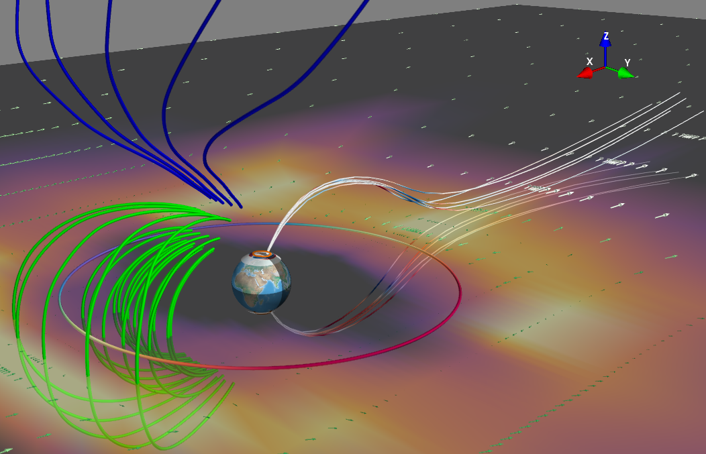

.. Viscid documentation master file, created by
   sphinx-quickstart on Tue Jul  2 01:44:29 2013.
   You can adapt this file completely to your liking, but it should at least
   contain the root `toctree` directive.

Viscid: Visualizing Plasma Simulations in Python
================================================

.. raw:: html

    

    

.. raw:: html

    

Viscid is a python framework to visualize scientific data on structured meshes. The following file types are understood,

+ XDMF + HDF5
+ OpenGGCM jrrle (3df, p[xyz], iof)
+ OpenGGCM binary (3df, p[xyz], iof)
+ Athena (bin, hst, tab)
+ VPIC
+ ASCII

There is also preliminary support for reading and plotting AMR datasets from XDMF files.

Below are some simple examples to get you started with Viscid. There are some far more interesting examples in the ``Viscid/tests`` directory, but they are not always as straight forward or documented as the examples here.

Source Code
-----------

Both the master and dev branches make every attempt to be usable (thanks to continuous integration), but the obvious caveats exist, i.e. the dev branch has more cool new features but it isn't *as* tested.

===================  ================  ========================================================
Branch               Test Status       Docs
===================  ================  ========================================================
`master <master_>`_  |travis-master|   `html <html_master_>`_, `test summary <tests_master_>`_
`dev <dev_>`_        |travis-dev|      `html <html_dev_>`_, `test summary <tests_dev_>`_
===================  ================  ========================================================

.. _master: https://github.com/viscid-hub/Viscid
.. _html_master: http://viscid-hub.github.io/Viscid-docs/docs/master/index.html
.. _tests_master: http://viscid-hub.github.io/Viscid-docs/summary/master-2.7/index.html
.. |travis-master| raw:: html

  <a href="https://travis-ci.com/viscid-hub/Viscid">
   

.. _dev: https://github.com/viscid-hub/Viscid/tree/dev
.. _html_dev: http://viscid-hub.github.io/Viscid-docs/docs/dev/index.html
.. _tests_dev: http://viscid-hub.github.io/Viscid-docs/summary/dev-2.7/index.html
.. |travis-dev| raw:: html

  <a href="https://travis-ci.com/viscid-hub/Viscid">
   

Installation
------------

.. image:: https://anaconda.org/viscid-hub/viscid/badges/version.svg
  :target: https://anaconda.org/viscid-hub/viscid
  :alt: Anaconda Version

.. image:: https://anaconda.org/viscid-hub/viscid/badges/platforms.svg
  :target: https://anaconda.org/viscid-hub/viscid
  :alt: Anaconda Platforms

.. image:: https://img.shields.io/pypi/v/Viscid.svg
  :target: https://pypi.org/project/Viscid/
  :alt: PyPI

Detailed instructions are :doc:`available here <installation>`.

Contents
--------

.. toctree::
  :maxdepth: 2

  installation
  philosophy
  indexing
  tutorial/index
  functions
  plot_options
  tips_and_tricks
  custom_behavior
  mpl_style_gallery
  dev_guide
  extending_readers

.. toctree::
  :maxdepth: 1

  API<api/viscid>

.. toctree::
  :maxdepth: 1

  ChangeLog<changes>

Indices and tables
==================

* :ref:`genindex`
* :ref:`modindex`
* :ref:`search`
