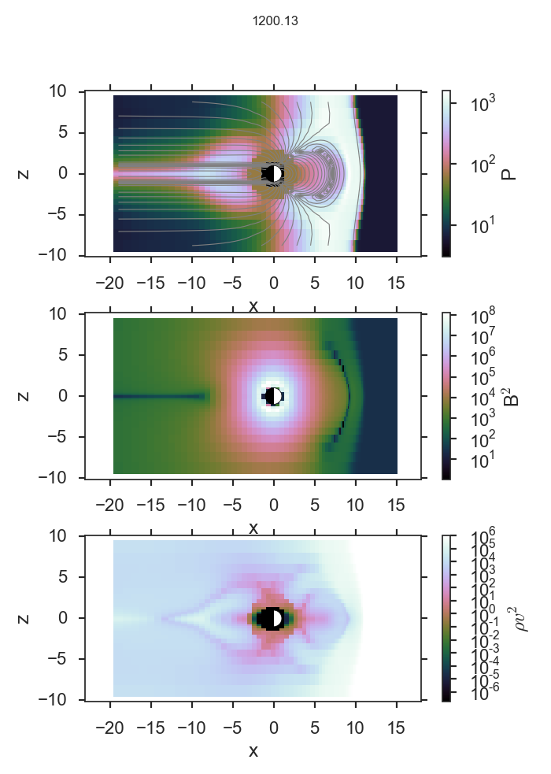
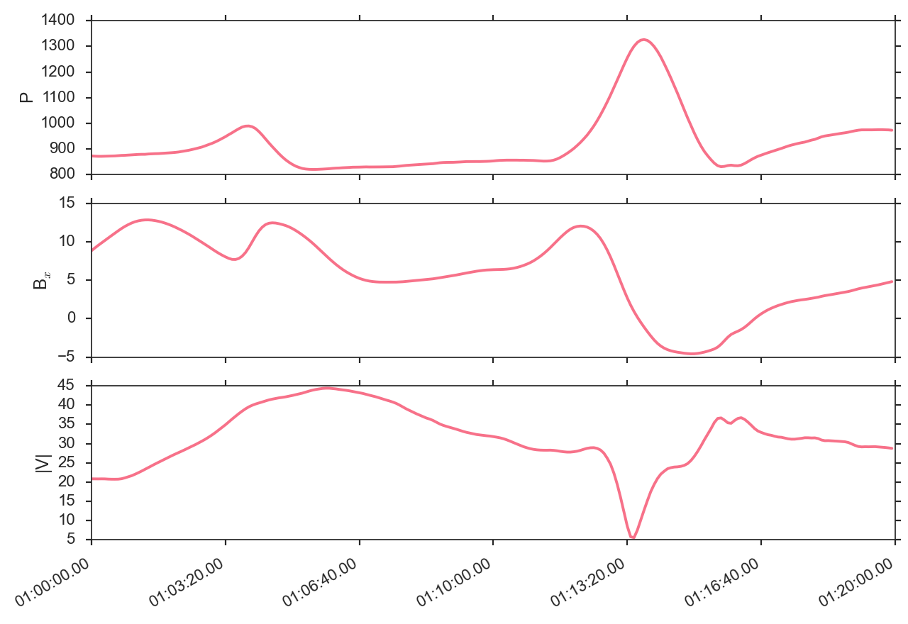
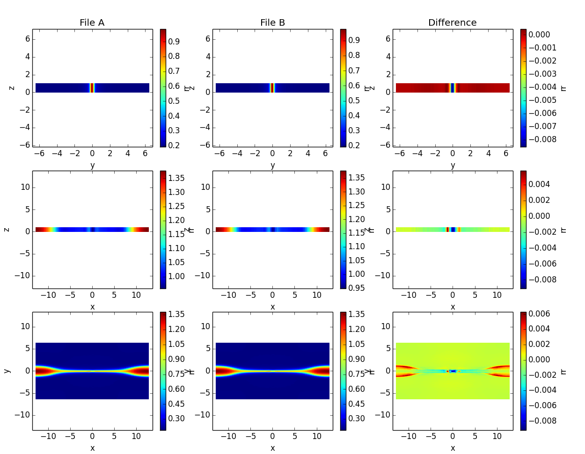

Command Line Utilities
======================

viscid
------

``viscid`` is a shell script that is a shortcut for :code:`python -im viscid.__main__`. This script defaults to IPython, and it tries to make sure the python and viscid versions jive regardless of PATH or PYTHONPATH. You can also specify :code:`mpl` or :code:`vlab` as arguments to automatically import matplotlib or mayavi.

viscid_2d
---------

``viscid_2d`` is a command line script for quickly generating 2D plots. In the following example, the `-p` options that have equations require that the evaluator is enabled in your viscidrc file (off by default for security reasons)::

  viscid_2d -o x_-15_10,y_-10_10,earth \
    -p 'P=pp' -o log \
    -p '^tmp=abs(psi)' -o log,style_contour,levels_30,linewidths=0.8,colors=grey,linestyles_solid \
    -p 'B$^2$=bx**2+by**2+bz**2' -o log \
    -p '$\rho v^2$=rr*(vx**2+vy**2+vz**2)' -o log \
    --slice x=-20.0f:15.0f,y=0.0f,z=-10.0f:10.0f -t T1:00:00.0 -s 7,15 --tighten \
    $DEV/src/Viscid/sample/*.py_0.xdmf

viscid_ts
---------

``viscid_ts`` is a script for quickly generating time series plots::

    viscid_ts -p 'P=pp' -o log -p 'B$_x$=bx' -p '|V|=sqrt(vx**2+vy**2+vz**2)' \
    --slice x=9.5,y=0.0f,z=0.0f --timeformat hms --rl -t T1:00:00.0:T1:20:00.0 \
    --nofname $MNT/trillian/scratch/da*e3/target/*.py_0.xdmf

viscid_diff
-----------

``viscid_diff`` is a command line script for diffing two files. By default it's very terse, but it can be made fairly verbose. The example below diffs two timesteps from the same run. A more useful use case for this utility is diffing two different runs that you expect to be equal, but you get the idea.

``viscid_diff --show *.3df.{000200,000201}.xdmf rr``

athena2xdmf
-----------

Convert athena data files to xdmf files.

bitmaskbits
-----------

Give it a number and it tells you which bits were on. Useful for decoding topology bitmasks.::

  $ bitmaskbits 552
  The following bits were on (bit, 2**bit)...
  3 (8)
  5 (32)
  9 (512)
