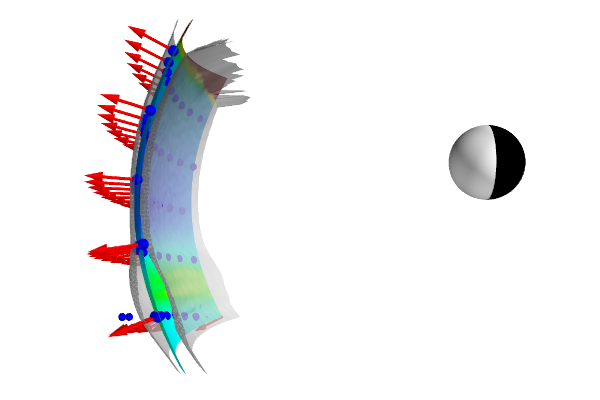
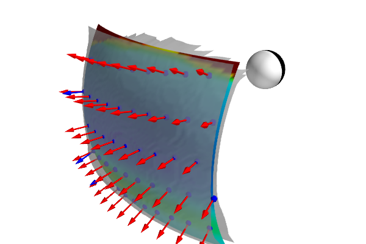

Extracting Magnetopause Information
===================================

Viscid has the ability to extract magnetopause information using :py:func:`viscid.get_mp_info`. By default, Viscid will cache the results into a set of hdf5+xdmf files so that it will not always load the larger 3d files.

|

|

.. code-block:: python

  import numpy as np
  import viscid
  from viscid.plot import vlab

  f = viscid.load_file("$WORK/xi_fte_001/*.3d.[4050f].xdmf")
  mp = viscid.get_mp_info(f['pp'], f['b'], f['j'], f['e_cc'], fit='mp_xloc',
                          slc="x=6.5f:10.5f, y=-4f:4f, z=-4.8f:3f",
                          cache=False)

  y, z = mp['pp_max_xloc'].meshgrid_flat(prune=True)
  x = mp['pp_max_xloc'].data.reshape(-1)

  Y, Z = mp['pp_max_xloc'].meshgrid(prune=True)
  x2 = viscid.paraboloid(Y, Z, *mp['paraboloid'][0])

  skip = 117

  # get normals from paraboloid surface
  parab_n = viscid.paraboloid_normal(Y, Z, *mp['paraboloid'][0])
  parab_n = parab_n.reshape(3, -1)[:, ::skip]

  # get normals from minvar
  minvar_y = Y.reshape(-1)[::skip]
  minvar_z = Z.reshape(-1)[::skip]
  minvar_n = np.zeros([3, len(minvar_y)])

  for i in range(minvar_n.shape[0]):
      p0 = [0.0, minvar_y[i], minvar_z[i]]
      p0[0] = mp['pp_max_xloc']['y={0[0]}f, z={0[1]}f'.format(p0)]
      lmn = viscid.find_minvar_lmn_around(f['b'], p0, l=2.0, n=64)
      minvar_n[:, i] = lmn[2, :]

  fig = vlab.mlab.figure(bgcolor=(1.0, 1.0, 1.0), fgcolor=(0.05, 0.05, 0.05),
                         size=(600, 400))

  grey = (0.80, ) * 3
  red = (1, 0, 0)
  blue = (0, 0, 1)

  vlab.points3d(x[::skip], y[::skip], z[::skip], scale_factor=0.25, color=blue)

  mp_width = mp['mp_width']['x=0']
  mp_sheath_edge = mp['mp_sheath_edge']['x=0']
  mp_sphere_edge = mp_sheath_edge - mp_width

  vlab.mesh(x2, Y, Z, scalars=mp_width.data, clim=(0.2, 0.8), cmap='plasma')
  vlab.mesh(mp_sheath_edge.data, Y, Z, opacity=0.75, color=grey)
  vlab.mesh(mp_sphere_edge.data, Y, Z, opacity=0.75, color=grey)

  vlab.quiver3d(x2.reshape(-1)[::skip],
                Y.reshape(-1)[::skip],
                Z.reshape(-1)[::skip],
                parab_n[0], parab_n[1], parab_n[2], color=red,
                mode='arrow')
  vlab.quiver3d(x2.reshape(-1)[::skip],
                Y.reshape(-1)[::skip],
                Z.reshape(-1)[::skip],
                minvar_n[0], minvar_n[1], minvar_n[2], color=blue,
                mode='arrow')

  vlab.plot_earth_3d(crd_system="gse")
  vlab.colorbar(title="Magnetopause Width")

  vlab.view(azimuth=+90.0, elevation=90.0,
            distance=22.0, focalpoint=(5.0, 0.0, -2.0))
  vlab.savefig("mpause-000.png")
  vlab.view(azimuth=+90.0 - 45.0, elevation=90.0 - 25.0,
            distance=25.0, focalpoint=(6.0, 0.0, -3.0))
  vlab.savefig("mpause-001.png")
