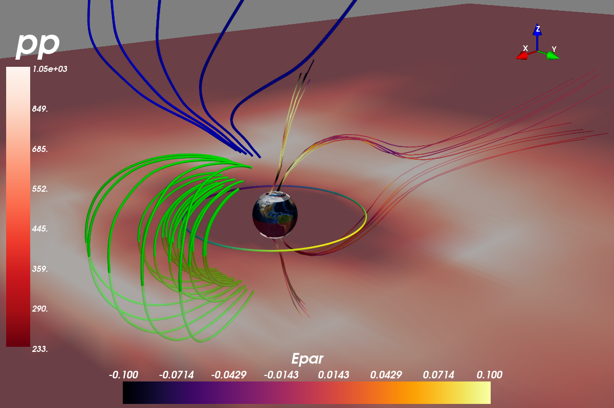

3D Plots (Mayavi)
=================

This best way to explain how to use Mayavi is by example, so here is the Mayavi part of the test suite ``tests/test_mvi.py``. :ref:`Check here <functions-mayavi>` for a discussion of Viscid's wrapper functions and workarounds.

.. note::

    Installing Mayavi can be tricky. Please :ref:`read this <installing-mayavi>` before attempting to install it.

|

.. literalinclude:: ../../tests/test_mvi.py
